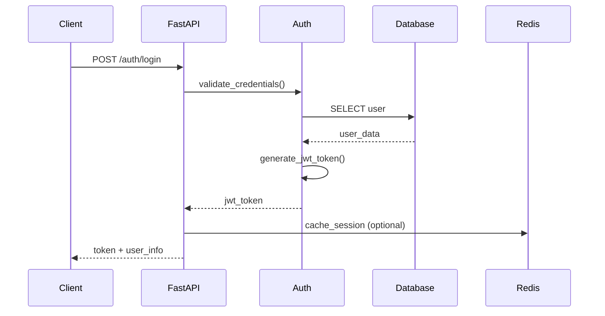
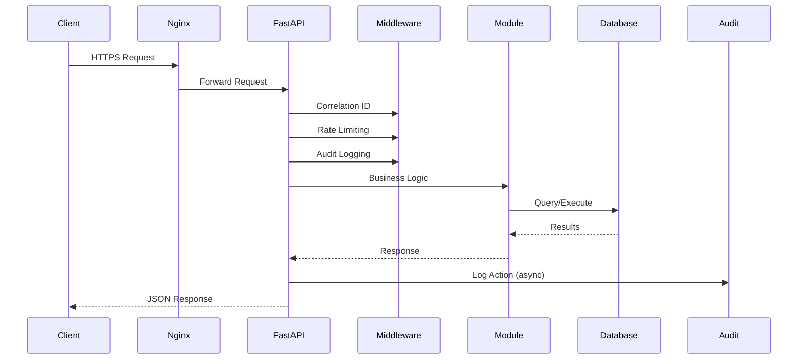
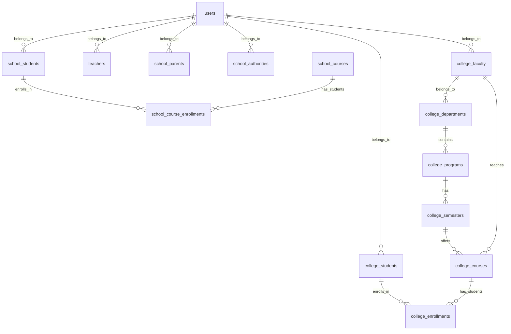
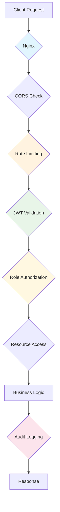
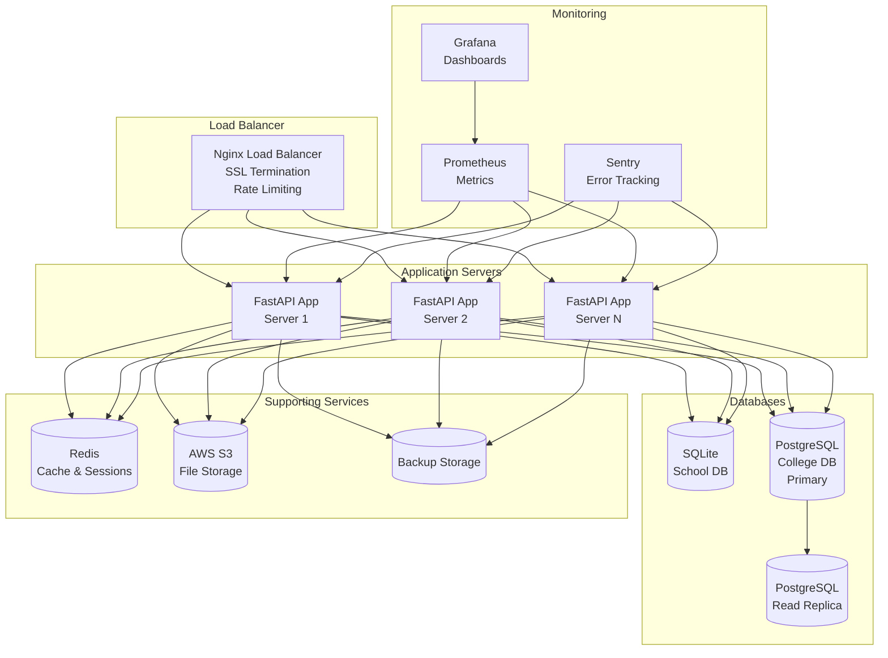
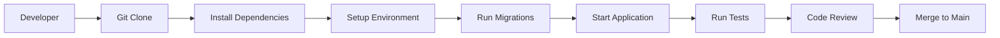
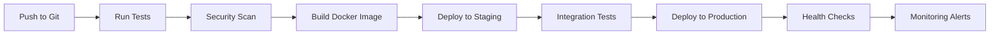

# System Architecture

## Overview

The College Management System is a modular, multi-tenant application built with FastAPI that manages both school and college operations. The system uses a dual-database architecture to maintain separation between school and college data while sharing common authentication and user management.

## High-Level Architecture

```mermaid
graph TB
    %% Frontend Layer
    subgraph "Frontend Layer"
        React[React Application<br/>Portals: School/College]
        Mobile[Mobile App<br/>(Future)]
    end

    %% API Gateway / Load Balancer
    subgraph "API Gateway"
        Nginx[Nginx Reverse Proxy<br/>SSL Termination<br/>Rate Limiting]
    end

    %% Application Layer
    subgraph "Application Layer"
        FastAPI[FastAPI Application<br/>REST API<br/>Authentication]

        subgraph "Core Modules"
            Auth[Authentication &<br/>Authorization]
            Shared[Shared Utilities<br/>Logger, Health, Audit]
        end

        subgraph "School Modules"
            SchoolCore[Core School<br/>Students, Teachers, Classes]
            SchoolLib[Library Management]
            SchoolExam[Exam Management]
            SchoolAttendance[Attendance Tracking]
            SchoolTransport[Transport Management]
            SchoolCanteen[Canteen Services]
            SchoolAlumni[Alumni Relations]
        end

        subgraph "College Modules"
            CollegeCore[Core College<br/>Faculty, Students, Programs]
            CollegeExam[Exam Section<br/>Results & Notices]
            CollegeAccount[Account Section<br/>Fee Management]
            CollegeEnroll[Enrollment Management]
            CollegeHostel[Hostel Management]
            CollegeLab[Lab Equipment]
            CollegeResearch[Research & Patents]
            CollegePlacement[Placement Services]
        end
    end

    %% Data Layer
    subgraph "Data Layer"
        subgraph "Primary Databases"
            SchoolDB[(SQLite<br/>school.db<br/>School Data)]
            CollegeDB[(PostgreSQL<br/>college.db<br/>College Data)]
        end

        subgraph "Supporting Services"
            Redis[(Redis<br/>Caching & Sessions<br/>Optional)]
            S3[(AWS S3<br/>File Storage &<br/>Backups)]
        end
    end

    %% External Services
    subgraph "External Services"
        Sentry[Sentry<br/>Error Tracking]
        Prometheus[Prometheus<br/>Metrics Monitoring]
        SMTP[SMTP Server<br/>Email Notifications]
    end

    %% Connections
    React --> Nginx
    Mobile --> Nginx
    Nginx --> FastAPI

    FastAPI --> Auth
    FastAPI --> Shared
    FastAPI --> SchoolCore
    FastAPI --> SchoolLib
    FastAPI --> SchoolExam
    FastAPI --> SchoolAttendance
    FastAPI --> SchoolTransport
    FastAPI --> SchoolCanteen
    FastAPI --> SchoolAlumni

    FastAPI --> CollegeCore
    FastAPI --> CollegeExam
    FastAPI --> CollegeAccount
    FastAPI --> CollegeEnroll
    FastAPI --> CollegeHostel
    FastAPI --> CollegeLab
    FastAPI --> CollegeResearch
    FastAPI --> CollegePlacement

    Auth --> SchoolDB
    Auth --> CollegeDB
    SchoolCore --> SchoolDB
    SchoolLib --> SchoolDB
    SchoolExam --> SchoolDB
    SchoolAttendance --> SchoolDB
    SchoolTransport --> SchoolDB
    SchoolCanteen --> SchoolDB
    SchoolAlumni --> SchoolDB

    CollegeCore --> CollegeDB
    CollegeExam --> CollegeDB
    CollegeAccount --> CollegeDB
    CollegeEnroll --> CollegeDB
    CollegeHostel --> CollegeDB
    CollegeLab --> CollegeDB
    CollegeResearch --> CollegeDB
    CollegePlacement --> CollegeDB

    FastAPI --> Redis
    FastAPI --> S3
    FastAPI --> Sentry
    FastAPI --> Prometheus
    FastAPI --> SMTP

    style FastAPI fill:#e1f5fe
    style Auth fill:#f3e5f5
    style Shared fill:#fff3e0
    style SchoolCore fill:#e8f5e8
    style CollegeCore fill:#fff8e1
    style SchoolDB fill:#e8f5e8
    style CollegeDB fill:#fff8e1
    style Redis fill:#fce4ec
    style S3 fill:#f3e5f5
```

## Module Architecture

### Shared Components
```
modules/shared/
├── config.py          # Application configuration
├── database.py        # Database connections
├── models.py          # Shared models (User, mixins)
├── logger.py          # Structured logging
├── middleware/        # Custom middleware
│   ├── correlation_id.py
│   ├── audit_middleware.py
├── rate_limit.py      # Rate limiting
├── health.py          # Health checks
├── sentry.py          # Error tracking
├── audit.py           # Audit logging models
└── audit_logger.py    # Audit logging service
```

### School Modules
```
modules/school/
├── school_teacher/    # Teacher management
├── school_student/    # Student management
├── school_parent/     # Parent management
├── school_authority/  # School authorities
├── school_account_section/  # Fee management
├── school_library/    # Library management
├── school_exam_section/  # Exam management
├── school_attendance/ # Attendance tracking
├── school_courses/    # Course management
├── school_assignments/ # Assignment management
├── school_tests/      # Test management
├── school_notices/    # Notice management
├── school_grades/     # Grade management
├── school_notes/      # Study notes
├── school_videos/     # Video content
├── school_hod/        # Head of Department
├── school_groups/     # Study groups
├── school_chat/       # Communication
├── school_timetable/  # Timetable management
├── school_dashboard/  # Dashboard views
└── school_transport/  # Transport management
```

### College Modules
```
modules/college/
├── college_faculty/   # Faculty management
├── college_students/  # Student management
├── college_departments/  # Department management
├── college_programs/  # Program management
├── college_semesters/ # Semester management
├── college_courses/   # Course management
├── college_enrollments/  # Enrollment management
├── college_exam_section/ # Exam results & notices
├── college_account_section/  # Fee management
├── college_registrar/ # Registrar functions
├── college_hod/       # College HOD
├── college_dean/      # Dean management
├── college_hostel/    # Hostel management
├── college_lab/       # Lab equipment
├── college_research/  # Research management
├── college_placement/ # Placement services
└── college_semesters/ # Semester management
```

## Data Flow Architecture

### Authentication Flow


### API Request Flow


## Database Architecture

### Dual Database Design
- **School Database (SQLite)**: Lightweight, file-based, suitable for school operations
- **College Database (PostgreSQL)**: Robust, concurrent, suitable for complex college operations
- **Shared User Table**: Authentication data shared between both systems

### Schema Relationships


## Security Architecture

### Authentication & Authorization
- **JWT Tokens**: Stateless authentication with expiration
- **Role-Based Access**: Hierarchical permissions (admin > dean > faculty > student)
- **Portal Separation**: School vs College access control
- **Session Management**: Optional Redis-based sessions

### Security Layers


## Deployment Architecture

### Production Stack


## Technology Stack

### Backend
- **Framework**: FastAPI (async Python web framework)
- **Language**: Python 3.11+
- **ORM**: SQLAlchemy (async support)
- **Databases**: SQLite (school), PostgreSQL (college)
- **Authentication**: JWT tokens with role-based access
- **Caching**: Redis (optional)
- **File Storage**: Local filesystem with S3 backup

### Frontend
- **Framework**: React with TypeScript
- **State Management**: Redux/Context API
- **Styling**: Tailwind CSS
- **Routing**: React Router
- **API Client**: Axios with interceptors

### DevOps & Monitoring
- **Containerization**: Docker
- **Orchestration**: Docker Compose (development)
- **Load Balancing**: Nginx
- **Monitoring**: Prometheus + Grafana
- **Error Tracking**: Sentry
- **Logging**: Structured JSON logs
- **CI/CD**: GitHub Actions (future)

### Security
- **HTTPS**: SSL/TLS encryption
- **Rate Limiting**: SlowAPI with Redis storage
- **Input Validation**: Pydantic schemas
- **CORS**: Configurable cross-origin policies
- **Audit Logging**: Complete transaction tracking
- **Soft Deletes**: Data recovery capabilities

## Development Workflow

### Local Development


### CI/CD Pipeline (Future)


## Performance Considerations

### Database Optimization
- **Connection Pooling**: SQLAlchemy async engine
- **Query Optimization**: Selective field loading
- **Indexing**: Strategic indexes on frequently queried fields
- **Read Replicas**: PostgreSQL read replicas for reporting

### Caching Strategy
- **Redis Caching**: Frequently accessed data
- **Application Cache**: In-memory LRU cache for static data
- **CDN**: Static assets served via CDN

### Scalability Features
- **Horizontal Scaling**: Stateless application design
- **Database Sharding**: Future partitioning strategy
- **Microservices Ready**: Modular architecture supports decomposition

## Backup & Recovery

### Automated Backup Strategy
- **School DB**: SQLite backup with compression (daily)
- **College DB**: PostgreSQL pg_dump (daily)
- **Retention**: 30 days with weekly archives
- **Storage**: Local with S3 offsite backup

### Disaster Recovery
- **Recovery Time Objective**: < 15 minutes for critical data
- **Recovery Point Objective**: < 1 hour data loss
- **Failover**: Database replication and automatic failover

## Compliance & Security

### Data Protection
- **GDPR Compliance**: Data minimization and user rights
- **Encryption**: Data at rest and in transit
- **Audit Trails**: Complete user action logging
- **Access Controls**: Principle of least privilege

### Security Standards
- **OWASP Top 10**: Protection against common vulnerabilities
- **Input Validation**: Comprehensive request sanitization
- **Rate Limiting**: DoS and brute force protection
- **Secure Headers**: HTTP security headers implementation

This architecture provides a scalable, secure, and maintainable foundation for the College Management System, supporting both school and college operations with enterprise-grade features and monitoring capabilities.