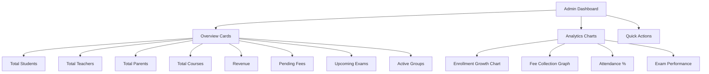
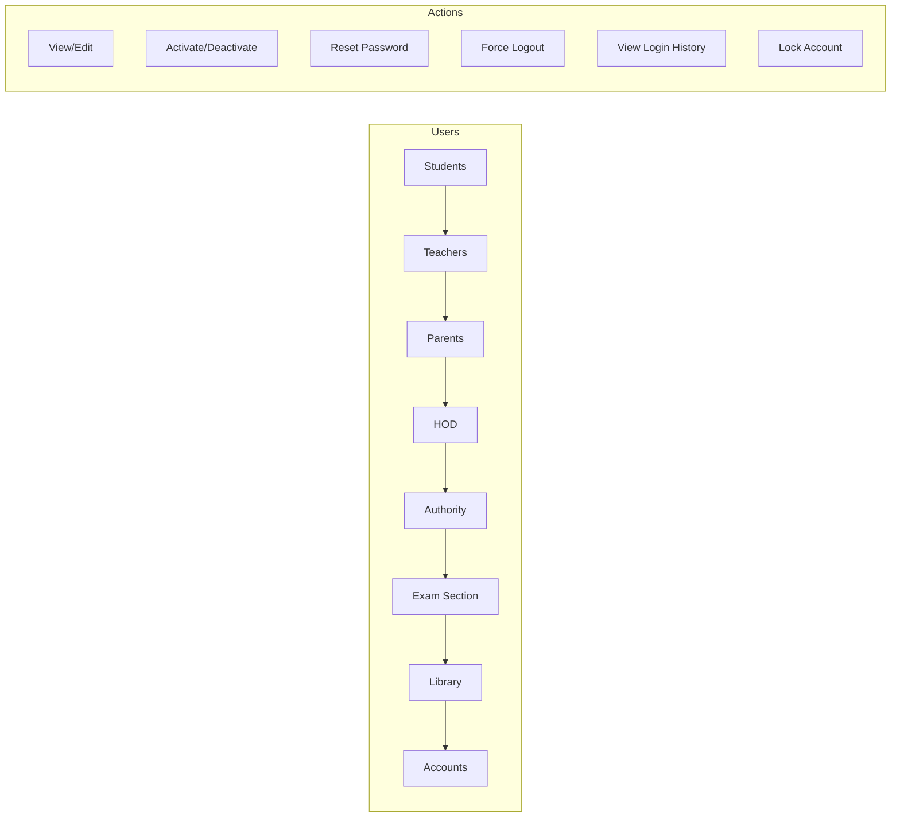
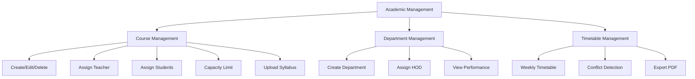
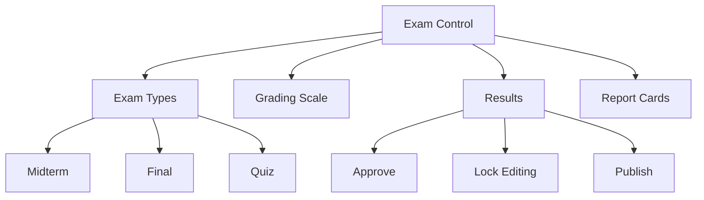
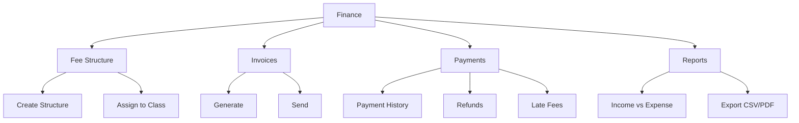

## admin_feature_control_plan.md

# Implementation Plan (2026-03-12)

## Phase 1: Data Foundations
- [x] Add SystemSetting and BackupRecord persistence
- [x] Add media approval fields (notes/videos)
- [x] Wire attendance analytics to real data

## Phase 2: Replace Placeholders With Real Data
- [x] Admin settings stored in DB (general, academic, localization, SMTP, payment, notifications, features)
- [x] Security panel uses real login history and settings
- [x] Media management lists notes/videos with approvals and storage stats
- [x] Reports generate real data and export CSV/PDF
- [x] Backup system supports SQLite backup/list/restore and export/import data
- [x] Advanced features use heuristic analytics, alerts, automations, broadcasts, and multi-school list

## Phase 3: Academic Timetable
- [x] Timetable list and conflict checks backed by Schedule table

## Status Update
- Completed: All modules in this plan now have working implementations (no placeholders).
- Notes: Backup/restore is SQLite-first; external DBs may need pg_dump integration.

# Enterprise Admin Panel - Implementation Plan

## Project Overview
Full-featured admin dashboard for Nexus Elite School Management System with 14 comprehensive modules.

---

## Executive Summary

### ✅ What's Already Built
| Component | Status | Location |
|-----------|--------|----------|
| Feature Control Models | Complete | `app/models/admin_models.py` |
| Admin Dashboard API | Basic | `app/api/endpoints/admin_dashboard.py` |
| Feature Management | Complete | `app/api/endpoints/admin_features.py` |
| Feature Service | Complete | `app/services/feature_service.py` |
| Admin Dashboard UI | Basic | `app/templates/admin/dashboard.html` |
| Analytics Template | Template Only | `app/templates/authority/analytics_v2.html` |
| Audit Logs UI | Complete | `app/templates/admin/audit_logs.html` |
| Settings UI | Basic | `app/templates/admin/settings.html` |

### 🎯 What's Missing (Needs Implementation)
- Real-time dashboard data integration
- Chart.js analytics with actual data
- Complete user management CRUD
- All 14 modules fully implemented

---

## Detailed Implementation Plan

### Phase 1: Core Admin Dashboard Enhancement



**Tasks:**
1.1 Enhance [`admin_dashboard.py`](app/api/endpoints/admin_dashboard.py) with real data queries
1.2 Update [`dashboard.html`](app/templates/admin/dashboard.html) with overview cards
1.3 Integrate Chart.js into analytics section

---

### Phase 2: User & Role Management



**API Endpoints to Create:**
- `GET /admin/users` - List all users
- `PATCH /admin/users/{id}/toggle-active` - Activate/deactivate
- `POST /admin/users/{id}/reset-password` - Reset password
- `POST /admin/users/{id}/force-logout` - Force logout
- `GET /admin/users/{id}/login-history` - Login history
- `POST /admin/users/{id}/lock` - Lock account

---

### Phase 3: Academic Management



---

### Phase 4: Exam & Result Control



---

### Phase 5: Finance & Fee Management



---

### Phase 6-14: Additional Modules

| Phase | Module | Key Features |
|-------|--------|--------------|
| 6 | Notices | Global, role-based, scheduled, emergency |
| 7 | Communication | Message moderation, analytics |
| 8 | Media | File management, storage limits, approval |
| 9 | System Monitor | Active users, server status, DB health |
| 10 | Security | JWT config, 2FA, audit logs |
| 11 | Backup | Manual/auto backup, restore |
| 12 | Reports | Attendance, fees, performance (PDF/CSV) |
| 13 | Settings | School info, SMTP, payment gateway |
| 14 | Advanced | AI prediction, alerts, multi-school |

---

## Implementation Priority

1. **Phase 1-2** (Dashboard + Users) - Week 1
2. **Phase 3-5** (Academic + Finance) - Week 2
3. **Phase 6-8** (Notices + Communication + Media) - Week 3
4. **Phase 9-11** (Monitor + Security + Backup) - Week 4
5. **Phase 12-14** (Reports + Settings + Advanced) - Week 5

---

## Technical Notes

### Database Models Needed
- `LoginHistory` - Track user logins
- `FailedLoginAttempt` - Track failed attempts
- `BackupRecord` - Backup history
- `SystemSettings` - Global settings
- `ExamType` - Exam categories
- `GradingScale` - Grade definitions
- `TimetableEntry` - Schedule data
- `MediaFile` - Uploaded files
- `ReportedMessage` - Chat reports

### API Structure
```
/api/v1/admin/
├── dashboard/          # Stats & overview
├── users/              # User management
├── users/{id}/history  # Login history
├── academic/           # Courses, depts, timetable
├── exams/              # Exam management
├── finance/            # Fee management
├── notices/            # Announcements
├── messages/           # Chat moderation
├── media/              # File management
├── system/             # Monitoring
├── security/           # Security settings
├── backup/             # Backup operations
├── reports/            # Report generation
└── settings/           # Global settings
```

### Frontend Pages
```
/admin/
├── dashboard/           # Main dashboard
├── users/              # User list
├── users/{id}/         # User detail
├── academic/           # Academic management
├── courses/            # Course management
├── departments/        # Department management
├── timetable/          # Timetable view
├── exams/              # Exam management
├── finance/            # Finance dashboard
├── fees/               # Fee management
├── notices/            # Notice management
├── messages/           # Message moderation
├── media/              # Media management
├── system/             # System monitoring
├── security/           # Security settings
├── backup/             # Backup management
├── reports/            # Reports
└── settings/           # Global settings
```

---

## Dependencies Required
- Chart.js (already in use)
- PDFKit or similar (for PDF generation)
- OpenPyXL (for Excel export)
- APScheduler (for scheduled tasks)
- PostgreSQL backup tools

---

## Security Considerations
- All admin endpoints require ADMIN role
- Implement rate limiting on sensitive operations
- Add IP whitelist for admin access
- Enable detailed audit logging
- Add 2FA for admin accounts
