# Endpoint Mapping - Master Index

## Overview

This document provides a high-level summary of all endpoint mapping plans for the migration from monolithic backup to modular structure.

---

## Summary Statistics

| Plan | Category | Endpoints | Modules | Status |
|------|----------|----------|---------|--------|
| Plan 1 | Authentication & User Management | 14 | `auth` | ✅ Complete |
| Plan 2 | School Role Modules | ~99 | `school_teacher`, `school_student`, `school_authority`, `school_parent` | ✅ Complete |
| Plan 3 | School Feature Modules | ~81 | `school_courses`, `school_assignments`, `school_grades`, `school_tests`, `school_notes`, `school_videos`, `school_groups`, `school_chat` | ✅ Complete |
| Plan 4 | School Operational Modules | ~42 | `school_attendance`, `school_account_section`, `school_notices`, `school_library`, `school_exam_section`, `school_hod` | ✅ Complete |
| Plan 5 | College Modules | ~70 | `college_student`, `college_faculty`, `college_departments`, `college_courses`, `college_enrollments`, `college_hostel`, `college_lab`, `college_placement`, `college_research`, `college_programs`, `college_semesters` | ✅ Complete |
| Plan 6 | Super Admin & System | ~163 | `super_admin` | ✅ Complete |
| Plan 7 | Web Routes & WebSocket | ~102 | `web_common`, `school_*` (web), `school_chat` (ws) | ✅ Complete |

**Total Endpoints: ~571**

---

## Module Mapping Summary

### Authentication
| Module | Endpoints | Status |
|--------|-----------|--------|
| `auth` | 14 | ✅ Complete |

### School Modules (19)
| Module | Endpoints | Status |
|--------|-----------|--------|
| `school_teacher` | ~22 | ⚠️ Partial |
| `school_student` | ~28 | ⚠️ Partial |
| `school_authority` | ~17 | ⚠️ Partial |
| `school_parent` | ~7 | ⚠️ Partial |
| `school_courses` | ~13 | ⚠️ Partial |
| `school_assignments` | ~10 | ⚠️ Partial |
| `school_grades` | ~7 | ⚠️ Partial |
| `school_tests` | ~13 | ⚠️ Partial |
| `school_notes` | ~8 | ⚠️ Partial |
| `school_videos` | ~8 | ⚠️ Partial |
| `school_groups` | ~17 | ⚠️ Partial |
| `school_chat` | ~11 | ⚠️ Partial |
| `school_attendance` | ~6 | ⚠️ Partial |
| `school_account_section` | ~17 | ⚠️ Partial |
| `school_notices` | ~10 | ⚠️ Partial |
| `school_library` | ~4 | ⚠️ Partial |
| `school_exam_section` | ~3 | ⚠️ Partial |
| `school_hod` | ~2 | 🆕 New |
| `school_timetable` | ~2 | 🆕 New |

### College Modules (11)
| Module | Endpoints | Status |
|--------|-----------|--------|
| `college_student` | ~7 | ⚠️ Partial |
| `college_faculty` | ~6 | ⚠️ Partial |
| `college_departments` | ~5 | 🆕 New |
| `college_courses` | ~5 | 🆕 New |
| `college_enrollments` | ~5 | 🆕 New |
| `college_hostel` | ~11 | ⚠️ Partial |
| `college_lab` | ~8 | ⚠️ Partial |
| `college_placement` | ~10 | ⚠️ Partial |
| `college_research` | ~7 | ⚠️ Partial |
| `college_programs` | ~2 | 🆕 New |
| `college_semesters` | ~2 | 🆕 New |

### Admin & System
| Module | Endpoints | Status |
|--------|-----------|--------|
| `super_admin` | ~163 | ⚠️ Partial |

---

## Duplicate Endpoints Identified

Many endpoints appear in both `/api/` and `/api/v1/school/` or `/api/v1/college/`. These have been consolidated to use the canonical module:

1. **Teacher endpoints** - duplicates between `/api/teachers/*` and `/api/v1/school/teachers/*`
2. **Student endpoints** - duplicates between `/api/students/*` and `/api/v1/school/students/*`
3. **Authority endpoints** - duplicates between `/api/authority/*` and `/api/v1/school/*`
4. **Course endpoints** - duplicates between `/api/courses/*` and `/api/v1/college/courses/*`

---

## Cross-Module Dependencies

```mermaid
graph TD
    subgraph School
        A[school_teacher] --> B[school_courses]
        A --> C[school_student]
        A --> D[school_assignments]
        A --> E[school_attendance]
        A --> F[school_grades]
        A --> G[school_tests]
        A --> H[school_timetable]
        
        I[school_student] --> B
        I --> D
        I --> F
        I --> E
        I --> J[school_account_section]
        I --> G
        I --> K[school_notices]
        I --> H
        I --> L[school_notes]
        I --> M[school_videos]
        
        N[school_authority] --> B
        N --> J
        K
        O[school_teacher]
        N --> O
        I
    end
    
    subgraph College
        P[college_student] --> Q[college_courses]
        P --> R[college_enrollments]
        P --> S[college_hostel]
        P --> T[college_placement]
        
        U[college_faculty] --> Q
        U --> V[college_departments]
    end
    
    subgraph Admin
        W[super_admin] --> A
        W --> I
        W --> N
        W --> P
        W --> U
    end
```

---

## Migration Priority

| Priority | Modules | Reason |
|----------|---------|--------|
| **High** | `school_teacher`, `school_student`, `school_courses`, `school_assignments`, `school_attendance`, `school_grades` | Core educational functionality |
| **Medium** | `school_notices`, `school_tests`, `school_account_section`, `school_authority`, `college_student`, `college_faculty` | Important secondary features |
| **Low** | `school_notes`, `school_videos`, `school_groups`, `school_chat`, `school_library`, `school_parent`, `college_*` (remaining) | Additional features |

---

## Files in This Plan

| File | Description |
|------|-------------|
| `mapping_plan1_auth.md` | Authentication & User Management (14 endpoints) |
| `mapping_plan2_school_roles.md` | School Role Modules (~99 endpoints) |
| `mapping_plan3_school_features.md` | School Feature Modules (~81 endpoints) |
| `mapping_plan4_school_ops.md` | School Operational Modules (~42 endpoints) |
| `mapping_plan5_college.md` | College Modules (~70 endpoints) |
| `mapping_plan6_super_admin.md` | Super Admin & System (~163 endpoints) |
| `mapping_plan7_web_routes.md` | Web Routes & WebSocket (~102 endpoints) |

---

## Next Steps

1. **Validate mapping** - Review the mapping plans with the user
2. **Proof of concept** - Generate code for `school_teacher` module as template
3. **Iterate** - Generate code for remaining modules based on priority
4. **Test** - Verify all endpoints work correctly
5. **Deploy** - Deploy to production
