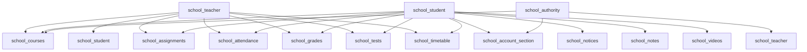

# Endpoint Mapping Plan 2: School Role Modules

## Overview

This document maps all school role-based endpoints (teacher, student, authority, parent) from the monolithic backup to the new modular structure.

---

## Source Files Analyzed

| File | Endpoints Count |
|------|-----------------|
| `backup/api/endpoints/teachers.py` | 11 endpoints |
| `backup/api/endpoints/students.py` | 14 endpoints |
| `backup/api/endpoints/authority.py` | 17 endpoints |
| `backup/api/endpoints/parents.py` | 7 endpoints |
| `backup/api/v1/school/teachers.py` | 12 endpoints |
| `backup/api/v1/school/students.py` | 14 endpoints |
| `backup/api/v1/school/authorities.py` | 17 endpoints |
| `backup/api/v1/school/parents.py` | 7 endpoints |
| **Total** | **~99 endpoints** (with duplicates) |

---

## Endpoint Mapping Table

### Teacher Endpoints

| Method | Old Endpoint | New Module | New Endpoint | Notes |
|--------|--------------|------------|--------------|-------|
| GET | `/api/teachers/me` | `school_teacher` | `/teachers/me` | Profile |
| PUT | `/api/teachers/me` | `school_teacher` | `/teachers/me` | Update profile |
| GET | `/api/teachers/dashboard` | `school_teacher` | `/teachers/dashboard` | Dashboard |
| GET | `/api/teachers/courses` | `school_courses` | `/courses/teacher/my` | Teacher's courses |
| GET | `/api/teachers/students` | `school_student` | `/students/teacher/{teacher_id}` | Students taught |
| GET | `/api/teachers/students/{student_id}` | `school_student` | `/students/{student_id}` | Student detail |
| GET | `/api/teachers/assignments` | `school_assignments` | `/assignments/teacher/my` | Teacher's assignments |
| GET | `/api/teachers/attendance` | `school_attendance` | `/attendance/teacher` | Teacher attendance |
| GET | `/api/teachers/grades` | `school_grades` | `/grades/teacher` | Teacher grades |
| GET | `/api/teachers/tests` | `school_tests` | `/tests/teacher/my` | Teacher tests |
| GET | `/api/teachers/timetable` | `school_timetable` | `/timetable/teacher` | Teacher timetable |
| GET | `/api/v1/school/teachers/me` | `school_teacher` | `/teachers/me` | Duplicate - use existing |
| PUT | `/api/v1/school/teachers/me` | `school_teacher` | `/teachers/me` | Duplicate - use existing |
| GET | `/api/v1/school/teachers/dashboard` | `school_teacher` | `/teachers/dashboard` | Duplicate - use existing |
| GET | `/api/v1/school/teachers/courses` | `school_courses` | `/courses/teacher/my` | Duplicate - use school_courses |
| GET | `/api/v1/school/teachers/students` | `school_student` | `/students/teacher/{teacher_id}` | Duplicate - use school_student |
| GET | `/api/v1/school/teachers/students/{student_id}` | `school_student` | `/students/{student_id}` | Duplicate - use school_student |
| GET | `/api/v1/school/teachers/assignments` | `school_assignments` | `/assignments/teacher/my` | Duplicate - use school_assignments |
| GET | `/api/v1/school/teachers/attendance` | `school_attendance` | `/attendance/teacher` | Duplicate - use school_attendance |
| GET | `/api/v1/school/teachers/grades` | `school_grades` | `/grades/teacher` | Duplicate - use school_grades |
| GET | `/api/v1/school/teachers/tests` | `school_tests` | `/tests/teacher/my` | Duplicate - use school_tests |
| GET | `/api/v1/school/teachers/timetable` | `school_timetable` | `/timetable/teacher` | Duplicate - use school_timetable |

### Student Endpoints

| Method | Old Endpoint | New Module | New Endpoint | Notes |
|--------|--------------|------------|--------------|-------|
| GET | `/api/students/me` | `school_student` | `/students/me` | Profile |
| PUT | `/api/students/me` | `school_student` | `/students/me` | Update profile |
| GET | `/api/students/dashboard` | `school_student` | `/students/dashboard` | Dashboard |
| GET | `/api/students/courses` | `school_courses` | `/courses/student/my` | Student's courses |
| GET | `/api/students/courses/{course_id}` | `school_courses` | `/courses/{course_id}` | Course details |
| GET | `/api/students/assignments` | `school_assignments` | `/assignments/student/my` | Student assignments |
| GET | `/api/students/grades` | `school_grades` | `/grades/student/my` | Student grades |
| GET | `/api/students/attendance` | `school_attendance` | `/attendance/student/my` | Student attendance |
| GET | `/api/students/fees` | `school_account_section` | `/fees/student/my` | Student fees |
| GET | `/api/students/tests` | `school_tests` | `/tests/student/available` | Available tests |
| GET | `/api/students/notices` | `school_notices` | `/notices/student/my` | Student notices |
| GET | `/api/students/timetable` | `school_timetable` | `/timetable/student/my` | Student timetable |
| GET | `/api/students/notes` | `school_notes` | `/notes/student/my` | Student notes |
| GET | `/api/students/videos` | `school_videos` | `/videos/student/my` | Student videos |
| GET | `/api/v1/school/students/me` | `school_student` | `/students/me` | Duplicate - use existing |
| PUT | `/api/v1/school/students/me` | `school_student` | `/students/me` | Duplicate - use existing |
| GET | `/api/v1/school/students/dashboard` | `school_student` | `/students/dashboard` | Duplicate - use existing |
| GET | `/api/v1/school/students/courses` | `school_courses` | `/courses/student/my` | Duplicate - use school_courses |
| GET | `/api/v1/school/students/courses/{course_id}` | `school_courses` | `/courses/{course_id}` | Duplicate - use school_courses |
| GET | `/api/v1/school/students/assignments` | `school_assignments` | `/assignments/student/my` | Duplicate - use school_assignments |
| GET | `/api/v1/school/students/grades` | `school_grades` | `/grades/student/my` | Duplicate - use school_grades |
| GET | `/api/v1/school/students/attendance` | `school_attendance` | `/attendance/student/my` | Duplicate - use school_attendance |
| GET | `/api/v1/school/students/fees` | `school_account_section` | `/fees/student/my` | Duplicate - use school_account_section |
| GET | `/api/v1/school/students/tests` | `school_tests` | `/tests/student/available` | Duplicate - use school_tests |
| GET | `/api/v1/school/students/notices` | `school_notices` | `/notices/student/my` | Duplicate - use school_notices |
| GET | `/api/v1/school/students/timetable` | `school_timetable` | `/timetable/student/my` | Duplicate - use school_timetable |
| GET | `/api/v1/school/students/notes` | `school_notes` | `/notes/student/my` | Duplicate - use school_notes |
| GET | `/api/v1/school/students/videos` | `school_videos` | `/videos/student/my` | Duplicate - use school_videos |

### Authority Endpoints

| Method | Old Endpoint | New Module | New Endpoint | Notes |
|--------|--------------|------------|--------------|-------|
| GET | `/api/authority/dashboard` | `school_authority` | `/authority/dashboard` | Dashboard |
| GET | `/api/authority/students` | `school_student` | `/students/` | All students |
| POST | `/api/authority/students` | `school_student` | `/students/` | Create student |
| PUT | `/api/authority/students/{student_id}` | `school_student` | `/students/{student_id}` | Update student |
| DELETE | `/api/authority/students/{student_id}` | `school_student` | `/students/{student_id}` | Delete student |
| GET | `/api/authority/teachers` | `school_teacher` | `/teachers/` | All teachers |
| POST | `/api/authority/teachers` | `school_teacher` | `/teachers/` | Create teacher |
| PUT | `/api/authority/teachers/{teacher_id}` | `school_teacher` | `/teachers/{teacher_id}` | Update teacher |
| DELETE | `/api/authority/teachers/{teacher_id}` | `school_teacher` | `/teachers/{teacher_id}` | Delete teacher |
| GET | `/api/authority/analytics/students` | `school_authority` | `/authority/analytics/students` | Student analytics |
| GET | `/api/authority/analytics/attendance` | `school_authority` | `/authority/analytics/attendance` | Attendance analytics |
| GET | `/api/authority/analytics/performance` | `school_authority` | `/authority/analytics/performance` | Performance analytics |
| GET | `/api/authority/courses` | `school_courses` | `/courses/` | All courses |
| GET | `/api/authority/fees` | `school_account_section` | `/fees/` | All fees |
| GET | `/api/authority/notices` | `school_notices` | `/notices/` | All notices |
| GET | `/api/authority/analytics` | `school_authority` | `/authority/analytics` | Analytics |
| GET | `/api/authority/reports` | `school_authority` | `/authority/reports` | Reports |
| GET | `/api/v1/school/dashboard` | `school_authority` | `/authority/dashboard` | Duplicate - use existing |
| GET | `/api/v1/school/students` | `school_student` | `/students/` | Duplicate - use school_student |
| POST | `/api/v1/school/students` | `school_student` | `/students/` | Duplicate - use school_student |
| PUT | `/api/v1/school/students/{student_id}` | `school_student` | `/students/{student_id}` | Duplicate - use school_student |
| DELETE | `/api/v1/school/students/{student_id}` | `school_student` | `/students/{student_id}` | Duplicate - use school_student |
| GET | `/api/v1/school/teachers` | `school_teacher` | `/teachers/` | Duplicate - use school_teacher |
| POST | `/api/v1/school/teachers` | `school_teacher` | `/teachers/` | Duplicate - use school_teacher |
| PUT | `/api/v1/school/teachers/{teacher_id}` | `school_teacher` | `/teachers/{teacher_id}` | Duplicate - use school_teacher |
| DELETE | `/api/v1/school/teachers/{teacher_id}` | `school_teacher` | `/teachers/{teacher_id}` | Duplicate - use school_teacher |
| GET | `/api/v1/school/analytics/students` | `school_authority` | `/authority/analytics/students` | Duplicate - use school_authority |
| GET | `/api/v1/school/analytics/attendance` | `school_authority` | `/authority/analytics/attendance` | Duplicate - use school_authority |
| GET | `/api/v1/school/analytics/performance` | `school_authority` | `/authority/analytics/performance` | Duplicate - use school_authority |
| GET | `/api/v1/school/courses` | `school_courses` | `/courses/` | Duplicate - use school_courses |
| GET | `/api/v1/school/fees` | `school_account_section` | `/fees/` | Duplicate - use school_account_section |
| GET | `/api/v1/school/notices` | `school_notices` | `/notices/` | Duplicate - use school_notices |
| GET | `/api/v1/school/analytics` | `school_authority` | `/authority/analytics` | Duplicate - use school_authority |
| GET | `/api/v1/school/reports` | `school_authority` | `/authority/reports` | Duplicate - use school_authority |

### Parent Endpoints

| Method | Old Endpoint | New Module | New Endpoint | Notes |
|--------|--------------|------------|--------------|-------|
| GET | `/api/parents/dashboard` | `school_parent` | `/parents/dashboard` | Dashboard (HTML) |
| GET | `/api/parents/profile` | `school_parent` | `/parents/profile` | Profile (HTML) |
| GET | `/api/parents/child/{student_id}/attendance` | `school_parent` | `/parents/child/{student_id}/attendance` | Child attendance (HTML) |
| GET | `/api/parents/child/{student_id}/grades` | `school_parent` | `/parents/child/{student_id}/grades` | Child grades (HTML) |
| GET | `/api/parents/child/{student_id}/homework` | `school_parent` | `/parents/child/{student_id}/homework` | Child homework (HTML) |
| GET | `/api/parents/notices` | `school_parent` | `/parents/notices` | Notices (HTML) |
| GET | `/api/parents/chat` | `school_chat` | `/chat/parents` | Chat (HTML) |
| GET | `/api/v1/school/parents/dashboard` | `school_parent` | `/parents/dashboard` | Duplicate - use existing |
| GET | `/api/v1/school/parents/profile` | `school_parent` | `/parents/profile` | Duplicate - use existing |
| GET | `/api/v1/school/parents/child/{student_id}/attendance` | `school_parent` | `/parents/child/{student_id}/attendance` | Duplicate - use existing |
| GET | `/api/v1/school/parents/child/{student_id}/grades` | `school_parent` | `/parents/child/{student_id}/grades` | Duplicate - use existing |
| GET | `/api/v1/school/parents/child/{student_id}/homework` | `school_parent` | `/parents/child/{student_id}/homework` | Duplicate - use existing |
| GET | `/api/v1/school/parents/notices` | `school_parent` | `/parents/notices` | Duplicate - use existing |
| GET | `/api/v1/school/parents/chat` | `school_chat` | `/chat/parents` | Duplicate - use school_chat |

---

## Module Status Summary

| Module | Endpoints | Status | Priority |
|--------|-----------|--------|----------|
| `school_teacher` | ~22 | ⚠️ Partial | High |
| `school_student` | ~28 | ⚠️ Partial | High |
| `school_authority` | ~17 | ⚠️ Partial | High |
| `school_parent` | ~7 | ⚠️ Partial | Medium |

---

## Cross-Module Dependencies

---

## Action Items

### school_teacher
- [ ] Add dashboard endpoint
- [ ] Add course listing for teacher
- [ ] Add student listing for teacher
- [ ] Add assignment listing for teacher
- [ ] Add attendance listing for teacher
- [ ] Add grades listing for teacher
- [ ] Add tests listing for teacher
- [ ] Add timetable for teacher

### school_student
- [ ] Add dashboard endpoint
- [ ] Add course listing for student
- [ ] Add assignment listing for student
- [ ] Add grades listing for student
- [ ] Add attendance listing for student
- [ ] Add fees listing for student
- [ ] Add tests listing for student
- [ ] Add notices listing for student
- [ ] Add timetable for student
- [ ] Add notes listing for student
- [ ] Add videos listing for student

### school_authority
- [ ] Add dashboard endpoint
- [ ] Add student CRUD endpoints
- [ ] Add teacher CRUD endpoints
- [ ] Add analytics endpoints
- [ ] Add reports endpoint

### school_parent
- [ ] Add dashboard endpoint
- [ ] Add child attendance endpoint
- [ ] Add child grades endpoint
- [ ] Add child homework endpoint
- [ ] Add notices endpoint
- [ ] Add chat endpoint
