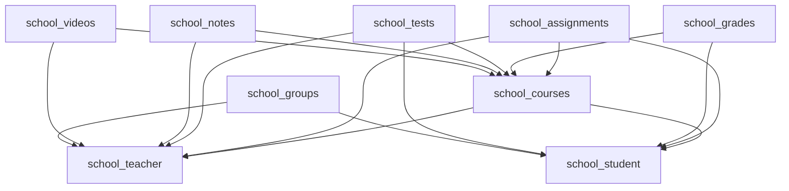

# Endpoint Mapping Plan 3: School Feature Modules

## Overview

This document maps all school feature-based endpoints (courses, assignments, grades, tests, notes, videos, groups, chat) from the monolithic backup to the new modular structure.

---

## Source Files Analyzed

| File | Endpoints Count |
|------|-----------------|
| `backup/api/endpoints/courses.py` | 7 endpoints |
| `backup/api/endpoints/assignments.py` | 10 endpoints |
| `backup/api/endpoints/grades.py` | 7 endpoints |
| `backup/api/endpoints/tests.py` | 13 endpoints |
| `backup/api/endpoints/notes.py` | 9 endpoints |
| `backup/api/endpoints/videos.py` | 8 endpoints |
| `backup/api/endpoints/groups.py` | 10 endpoints |
| `backup/api/endpoints/group_posts.py` | 7 endpoints |
| `backup/api/endpoints/chat.py` | 10 endpoints |
| **Total** | **~81 endpoints** |

---

## Endpoint Mapping Table

### Courses Endpoints

| Method | Old Endpoint | New Module | New Endpoint | Notes |
|--------|--------------|------------|--------------|-------|
| GET | `/api/courses/` | `school_courses` | `/courses/` | List all courses |
| GET | `/api/courses/{course_id}` | `school_courses` | `/courses/{course_id}` | Get course |
| POST | `/api/courses/` | `school_courses` | `/courses/` | Create course |
| PUT | `/api/courses/{course_id}` | `school_courses` | `/courses/{course_id}` | Update course |
| DELETE | `/api/courses/{course_id}` | `school_courses` | `/courses/{course_id}` | Delete course |
| GET | `/api/courses/{course_id}/students` | `school_courses` | `/courses/{course_id}/students` | Course students |
| GET | `/api/courses/search/{query}` | `school_courses` | `/courses/search/{query}` | Search courses |
| GET | `/api/v1/school/courses` | `school_courses` | `/courses/` | Duplicate - use existing |
| GET | `/api/v1/college/courses` | `college_courses` | `/college/courses/` | College courses |
| POST | `/api/v1/college/courses` | `college_courses` | `/college/courses/` | Create college course |
| GET | `/api/v1/college/courses/{course_id}` | `college_courses` | `/college/courses/{course_id}` | Get college course |
| PATCH | `/api/v1/college/courses/{course_id}` | `college_courses` | `/college/courses/{course_id}` | Update college course |
| DELETE | `/api/v1/college/courses/{course_id}` | `college_courses` | `/college/courses/{course_id}` | Delete college course |

### Assignments Endpoints

| Method | Old Endpoint | New Module | New Endpoint | Notes |
|--------|--------------|------------|--------------|-------|
| POST | `/api/assignments/` | `school_assignments` | `/assignments/` | Create assignment |
| POST | `/api/assignments/{assignment_id}/upload` | `school_assignments` | `/assignments/{assignment_id}/upload` | Upload file |
| GET | `/api/assignments/teacher/my-assignments` | `school_assignments` | `/assignments/teacher/my` | Teacher's assignments |
| GET | `/api/assignments/{assignment_id}/submissions` | `school_assignments` | `/assignments/{assignment_id}/submissions` | Get submissions |
| PUT | `/api/assignments/submissions/{submission_id}/grade` | `school_assignments` | `/assignments/submissions/{submission_id}/grade` | Grade submission |
| PUT | `/api/assignments/{assignment_id}` | `school_assignments` | `/assignments/{assignment_id}` | Update assignment |
| DELETE | `/api/assignments/{assignment_id}` | `school_assignments` | `/assignments/{assignment_id}` | Delete assignment |
| GET | `/api/assignments/{assignment_id}` | `school_assignments` | `/assignments/{assignment_id}` | Get assignment |
| POST | `/api/assignments/{assignment_id}/submit` | `school_assignments` | `/assignments/{assignment_id}/submit` | Submit assignment |
| GET | `/api/assignments/{assignment_id}/my-submission` | `school_assignments` | `/assignments/{assignment_id}/my-submission` | My submission |

### Grades Endpoints

| Method | Old Endpoint | New Module | New Endpoint | Notes |
|--------|--------------|------------|--------------|-------|
| POST | `/api/grades/` | `school_grades` | `/grades/` | Add grade |
| POST | `/api/grades/bulk` | `school_grades` | `/grades/bulk` | Add bulk grades |
| PUT | `/api/grades/{grade_id}` | `school_grades` | `/grades/{grade_id}` | Update grade |
| DELETE | `/api/grades/{grade_id}` | `school_grades` | `/grades/{grade_id}` | Delete grade |
| GET | `/api/grades/course/{course_id}` | `school_grades` | `/grades/course/{course_id}` | Course grades |
| GET | `/api/grades/course/{course_id}/top-performers` | `school_grades` | `/grades/course/{course_id}/top-performers` | Top performers |
| GET | `/api/grades/my-grades` | `school_grades` | `/grades/student/my` | My grades |

### Tests Endpoints

| Method | Old Endpoint | New Module | New Endpoint | Notes |
|--------|--------------|------------|--------------|-------|
| POST | `/api/tests/` | `school_tests` | `/tests/` | Create test |
| GET | `/api/tests/teacher/my-tests` | `school_tests` | `/tests/teacher/my` | Teacher's tests |
| GET | `/api/tests/teacher/{test_id}` | `school_tests` | `/tests/{test_id}` | Get test for teacher |
| PUT | `/api/tests/{test_id}` | `school_tests` | `/tests/{test_id}` | Update test |
| DELETE | `/api/tests/{test_id}` | `school_tests` | `/tests/{test_id}` | Delete test |
| GET | `/api/tests/{test_id}/results` | `school_tests` | `/tests/{test_id}/results` | Test results |
| GET | `/api/tests/student/available` | `school_tests` | `/tests/student/available` | Available tests |
| GET | `/api/tests/student/{test_id}` | `school_tests` | `/tests/{test_id}` | Get test for student |
| POST | `/api/tests/{test_id}/start` | `school_tests` | `/tests/{test_id}/start` | Start test |
| POST | `/api/tests/{test_id}/submit` | `school_tests` | `/tests/{test_id}/submit` | Submit test |
| GET | `/api/tests/student/{test_id}/result` | `school_tests` | `/tests/{test_id}/result` | Test result |
| GET | `/api/tests/student/my-results` | `school_tests` | `/tests/student/my-results` | My results |

### Notes Endpoints

| Method | Old Endpoint | New Module | New Endpoint | Notes |
|--------|--------------|------------|--------------|-------|
| POST | `/api/notes/upload` | `school_notes` | `/notes/upload` | Upload note |
| GET | `/api/notes/teacher/my-notes` | `school_notes` | `/notes/teacher/my` | My notes |
| DELETE | `/api/notes/{note_id}` | `school_notes` | `/notes/{note_id}` | Delete note |
| GET | `/api/notes/course/{course_id}` | `school_notes` | `/notes/course/{course_id}` | Course notes |
| GET | `/api/notes/{note_id}` | `school_notes` | `/notes/{note_id}` | Get note |
| GET | `/api/notes/{note_id}/download` | `school_notes` | `/notes/{note_id}/download` | Download note |
| GET | `/api/notes/search/{query}` | `school_notes` | `/notes/search/{query}` | Search notes |
| GET | `/api/notes/recent/all` | `school_notes` | `/notes/recent` | Recent notes |

### Videos Endpoints

| Method | Old Endpoint | New Module | New Endpoint | Notes |
|--------|--------------|------------|--------------|-------|
| POST | `/api/videos/upload` | `school_videos` | `/videos/upload` | Upload video |
| GET | `/api/videos/teacher/my-videos` | `school_videos` | `/videos/teacher/my` | My videos |
| GET | `/api/videos/{video_id}` | `school_videos` | `/videos/{video_id}` | Get video |
| DELETE | `/api/videos/{video_id}` | `school_videos` | `/videos/{video_id}` | Delete video |
| GET | `/api/videos/course/{course_id}` | `school_videos` | `/videos/course/{course_id}` | Course videos |
| GET | `/api/videos/{video_id}/stream` | `school_videos` | `/videos/{video_id}/stream` | Stream video |
| GET | `/api/videos/search/{query}` | `school_videos` | `/videos/search/{query}` | Search videos |
| GET | `/api/videos/recent/all` | `school_videos` | `/videos/recent` | Recent videos |

### Groups Endpoints

| Method | Old Endpoint | New Module | New Endpoint | Notes |
|--------|--------------|------------|--------------|-------|
| GET | `/api/groups/` | `school_groups` | `/groups/` | List groups (HTML) |
| GET | `/api/groups/create` | `school_groups` | `/groups/create` | Create group page (HTML) |
| POST | `/api/groups/create` | `school_groups` | `/groups/` | Create group |
| GET | `/api/groups/{group_id}` | `school_groups` | `/groups/{group_id}` | Group detail (HTML) |
| GET | `/api/groups/{group_id}/edit` | `school_groups` | `/groups/{group_id}/edit` | Edit group page (HTML) |
| POST | `/api/groups/{group_id}/edit` | `school_groups` | `/groups/{group_id}` | Update group |
| GET | `/api/groups/{group_id}/manage` | `school_groups` | `/groups/{group_id}/manage` | Manage members page (HTML) |
| POST | `/api/groups/{group_id}/members/add` | `school_groups` | `/groups/{group_id}/members` | Add members |
| POST | `/api/groups/{group_id}/members/{user_id}/remove` | `school_groups` | `/groups/{group_id}/members/{user_id}` | Remove member |
| GET | `/api/groups/api/{group_id}/members` | `school_groups` | `/groups/{group_id}/members` | Get group members API |

### Group Posts Endpoints

| Method | Old Endpoint | New Module | New Endpoint | Notes |
|--------|--------------|------------|--------------|-------|
| GET | `/api/group-posts/` | `school_groups` | `/groups/posts/` | List posts (HTML) |
| GET | `/api/group-posts/create` | `school_groups` | `/groups/posts/create` | Create post page (HTML) |
| POST | `/api/group-posts/create` | `school_groups` | `/groups/posts/` | Create post |
| GET | `/api/group-posts/{post_id}` | `school_groups` | `/groups/posts/{post_id}` | View post (HTML) |
| POST | `/api/group-posts/{post_id}/delete` | `school_groups` | `/groups/posts/{post_id}` | Delete post |
| GET | `/api/group-posts/api/posts` | `school_groups` | `/groups/posts/api` | Get posts API |

### Chat Endpoints

| Method | Old Endpoint | New Module | New Endpoint | Notes |
|--------|--------------|------------|--------------|-------|
| GET | `/api/chat/conversations` | `school_chat` | `/chat/conversations` | Get conversations |
| GET | `/api/chat/messages/{other_user_id}` | `school_chat` | `/chat/messages/{other_user_id}` | Get messages |
| POST | `/api/chat/messages/{receiver_id}` | `school_chat` | `/chat/messages/{receiver_id}` | Send message |
| POST | `/api/chat/mark-read/{sender_id}` | `school_chat` | `/chat/mark-read/{sender_id}` | Mark messages read |
| GET | `/api/chat/unread-count` | `school_chat` | `/chat/unread-count` | Get unread count |
| GET | `/api/chat/online-users` | `school_chat` | `/chat/online-users` | Get online users |
| GET | `/api/chat/search/{query}` | `school_chat` | `/chat/search/{query}` | Search users |
| GET | `/api/chat/contacts/parent` | `school_chat` | `/chat/contacts/parent` | Get parent contacts |
| GET | `/api/chat/contacts/teacher` | `school_chat` | `/chat/contacts/teacher` | Get teacher contacts |
| GET | `/api/chat/search-messages/{query}` | `school_chat` | `/chat/search-messages/{query}` | Search messages |

---

## Module Status Summary

| Module | Endpoints | Status | Priority |
|--------|-----------|--------|----------|
| `school_courses` | ~13 | ⚠️ Partial | High |
| `school_assignments` | ~10 | ⚠️ Partial | High |
| `school_grades` | ~7 | ⚠️ Partial | High |
| `school_tests` | ~13 | ⚠️ Partial | High |
| `school_notes` | ~8 | ⚠️ Partial | Medium |
| `school_videos` | ~8 | ⚠️ Partial | Medium |
| `school_groups` | ~17 | ⚠️ Partial | Medium |
| `school_chat` | ~10 | ⚠️ Partial | Medium |

---

## Cross-Module Dependencies

---

## Action Items

### school_courses
- [ ] Add search endpoint
- [ ] Add course students endpoint
- [ ] Add role-based filtering (teacher/student)

### school_assignments
- [ ] Add upload endpoint
- [ ] Add submissions listing
- [ ] Add grading endpoint
- [ ] Add submission endpoint

### school_grades
- [ ] Add bulk grades endpoint
- [ ] Add top performers endpoint
- [ ] Add role-based filtering

### school_tests
- [ ] Add test creation
- [ ] Add test start/submit
- [ ] Add results listing

### school_notes
- [ ] Add upload endpoint
- [ ] Add download endpoint
- [ ] Add search endpoint

### school_videos
- [ ] Add upload endpoint
- [ ] Add streaming endpoint
- [ ] Add search endpoint

### school_groups
- [ ] Add CRUD operations
- [ ] Add member management
- [ ] Add posts management

### school_chat
- [ ] Add messaging endpoints
- [ ] Add contacts listing
- [ ] Add search functionality
