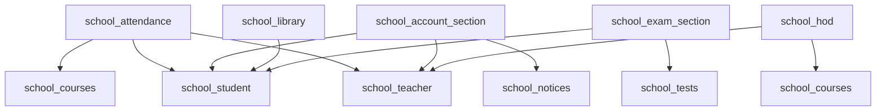

# Endpoint Mapping Plan 4: School Operational Modules

## Overview

This document maps all school operational endpoints (attendance, fees, notices, library, exam_section, account, hod) from the monolithic backup to the new modular structure.

---

## Source Files Analyzed

| File | Endpoints Count |
|------|-----------------|
| `backup/api/endpoints/attendance.py` | 6 endpoints |
| `backup/api/endpoints/fees.py` | 13 endpoints |
| `backup/api/endpoints/notices.py` | 10 endpoints |
| `backup/api/endpoints/library.py` | 4 endpoints |
| `backup/api/endpoints/exam_section.py` | 3 endpoints |
| `backup/api/endpoints/account.py` | 4 endpoints |
| `backup/api/endpoints/hod.py` | 2 endpoints |
| **Total** | **~42 endpoints** |

---

## Endpoint Mapping Table

### Attendance Endpoints

| Method | Old Endpoint | New Module | New Endpoint | Notes |
|--------|--------------|------------|--------------|-------|
| POST | `/api/attendance/` | `school_attendance` | `/attendance/` | Mark attendance |
| POST | `/api/attendance/bulk` | `school_attendance` | `/attendance/bulk` | Mark bulk attendance |
| GET | `/api/attendance/course/{course_id}` | `school_attendance` | `/attendance/course/{course_id}` | Course attendance |
| GET | `/api/attendance/course/{course_id}/stats` | `school_attendance` | `/attendance/course/{course_id}/stats` | Course stats |
| GET | `/api/attendance/my-attendance` | `school_attendance` | `/attendance/student/my` | My attendance |
| GET | `/api/attendance/my-attendance/course/{course_id}` | `school_attendance` | `/attendance/student/my/course/{course_id}` | My course attendance |

### Fees Endpoints

| Method | Old Endpoint | New Module | New Endpoint | Notes |
|--------|--------------|------------|--------------|-------|
| POST | `/api/fees/` | `school_account_section` | `/fees/` | Create fee record |
| POST | `/api/fees/bulk` | `school_account_section` | `/fees/bulk` | Create bulk fees |
| PUT | `/api/fees/{fee_id}` | `school_account_section` | `/fees/{fee_id}` | Update fee record |
| POST | `/api/fees/{fee_id}/payment` | `school_account_section` | `/fees/{fee_id}/payment` | Record payment |
| DELETE | `/api/fees/{fee_id}` | `school_account_section` | `/fees/{fee_id}` | Delete fee record |
| GET | `/api/fees/summary` | `school_account_section` | `/fees/summary` | All fees summary |
| GET | `/api/fees/overdue` | `school_account_section` | `/fees/overdue` | All overdue fees |
| GET | `/api/fees/student/{student_id}` | `school_account_section` | `/fees/student/{student_id}` | Student fees |
| GET | `/api/fees/type/{fee_type}` | `school_account_section` | `/fees/type/{fee_type}` | Fees by type |
| GET | `/api/fees/my-fees` | `school_account_section` | `/fees/student/my` | My fees |
| GET | `/api/fees/my-fees/pending` | `school_account_section` | `/fees/student/my/pending` | My pending fees |
| GET | `/api/fees/my-fees/overdue` | `school_account_section` | `/fees/student/my/overdue` | My overdue fees |
| GET | `/api/fees/my-fees/payment-history` | `school_account_section` | `/fees/student/my/payment-history` | My payment history |

### Notices Endpoints

| Method | Old Endpoint | New Module | New Endpoint | Notes |
|--------|--------------|------------|--------------|-------|
| POST | `/api/notices/` | `school_notices` | `/notices/` | Create notice |
| POST | `/api/notices/{notice_id}/upload` | `school_notices` | `/notices/{notice_id}/upload` | Upload notice file |
| PUT | `/api/notices/{notice_id}` | `school_notices` | `/notices/{notice_id}` | Update notice |
| DELETE | `/api/notices/{notice_id}` | `school_notices` | `/notices/{notice_id}` | Delete notice |
| GET | `/api/notices/all` | `school_notices` | `/notices/` | All notices (admin) |
| GET | `/api/notices/` | `school_notices` | `/notices/` | Get notices |
| GET | `/api/notices/urgent` | `school_notices` | `/notices/urgent` | Urgent notices |
| GET | `/api/notices/recent` | `school_notices` | `/notices/recent` | Recent notices |
| GET | `/api/notices/{notice_id}` | `school_notices` | `/notices/{notice_id}` | Get notice |
| GET | `/api/notices/search/{query}` | `school_notices` | `/notices/search/{query}` | Search notices |

### Library Endpoints

| Method | Old Endpoint | New Module | New Endpoint | Notes |
|--------|--------------|------------|--------------|-------|
| POST | `/library/loans` | `school_library` | `/library/loans` | Issue book |
| POST | `/library/loans/{loan_id}/return` | `school_library` | `/library/loans/{loan_id}/return` | Return book |
| GET | `/library/loans` | `school_library` | `/library/loans` | Get all loans |
| GET | `/library/loans/student/{student_id}` | `school_library` | `/library/loans/student/{student_id}` | Student loans |

### Exam Section Endpoints

| Method | Old Endpoint | New Module | New Endpoint | Notes |
|--------|--------------|------------|--------------|-------|
| POST | `/exam-section/results` | `school_exam_section` | `/exam-section/results` | Publish exam result |
| GET | `/exam-section/results` | `school_exam_section` | `/exam-section/results` | Get all results |
| GET | `/exam-section/results/student/{student_id}` | `school_exam_section` | `/exam-section/results/student/{student_id}` | Student results |

### Account Endpoints

| Method | Old Endpoint | New Module | New Endpoint | Notes |
|--------|--------------|------------|--------------|-------|
| POST | `/account/payments` | `school_account_section` | `/account/payments` | Record teacher payment |
| GET | `/account/payments` | `school_account_section` | `/account/payments` | Get all payments |
| GET | `/account/payments/teacher/{teacher_id}` | `school_account_section` | `/account/payments/teacher/{teacher_id}` | Teacher payments |
| GET | `/account/stats` | `school_account_section` | `/account/stats` | Account stats |

### HOD Endpoints

| Method | Old Endpoint | New Module | New Endpoint | Notes |
|--------|--------------|------------|--------------|-------|
| GET | `/hod/dashboard` | `school_hod` | `/hod/dashboard` | Get HOD dashboard |
| GET | `/hod/departments` | `school_hod` | `/hod/departments` | Get all departments |

---

## Module Status Summary

| Module | Endpoints | Status | Priority |
|--------|-----------|--------|----------|
| `school_attendance` | ~6 | ⚠️ Partial | High |
| `school_account_section` | ~17 | ⚠️ Partial | High |
| `school_notices` | ~10 | ⚠️ Partial | High |
| `school_library` | ~4 | ⚠️ Partial | Medium |
| `school_exam_section` | ~3 | ⚠️ Partial | Medium |
| `school_hod` | ~2 | 🆕 New | Medium |

---

## Cross-Module Dependencies

---

## Action Items

### school_attendance
- [ ] Add bulk attendance marking
- [ ] Add course attendance stats
- [ ] Add my attendance endpoints
- [ ] Add role-based filtering

### school_account_section
- [ ] Add fee creation
- [ ] Add bulk fee creation
- [ ] Add payment recording
- [ ] Add fee summary
- [ ] Add overdue fees
- [ ] Add student fees
- [ ] Add my fees endpoints
- [ ] Add account payments
- [ ] Add account stats

### school_notices
- [ ] Add notice creation
- [ ] Add notice update
- [ ] Add notice delete
- [ ] Add upload functionality
- [ ] Add search
- [ ] Add urgent/recent filters

### school_library
- [ ] Add book loan issuance
- [ ] Add book return
- [ ] Add loan listing
- [ ] Add student loans

### school_exam_section
- [ ] Add result publication
- [ ] Add results listing
- [ ] Add student results

### school_hod
- [ ] Create new module
- [ ] Add dashboard endpoint
- [ ] Add departments listing
