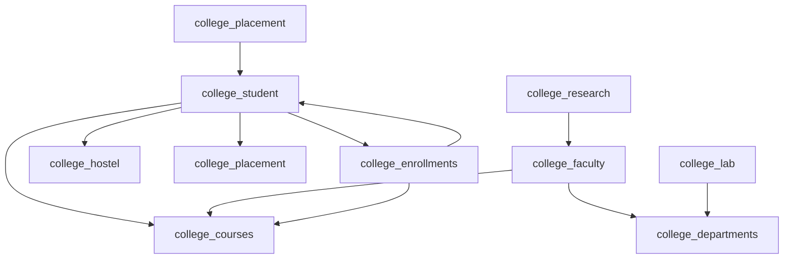

# Endpoint Mapping Plan 5: College Modules

## Overview

This document maps all college endpoints from the monolithic backup to the new modular structure.

---

## Source Files Analyzed

| File | Endpoints Count |
|------|-----------------|
| `backup/api/v1/college/students.py` | 7 endpoints |
| `backup/api/v1/college/faculty.py` | 7 endpoints |
| `backup/api/v1/college/departments.py` | 5 endpoints |
| `backup/api/v1/college/courses.py` | 5 endpoints |
| `backup/api/v1/college/enrollments.py` | 5 endpoints |
| `backup/api/v1/college/hostels.py` | 11 endpoints |
| `backup/api/v1/college/labs.py` | 8 endpoints |
| `backup/api/v1/college/placements.py` | 10 endpoints |
| `backup/api/v1/college/research.py` | 7 endpoints |
| `backup/api/v1/college/programs.py` | 2 endpoints |
| `backup/api/v1/college/semesters.py` | 2 endpoints |
| `backup/api/v1/college/auth.py` | 1 endpoint |
| **Total** | **~70 endpoints** |

---

## Endpoint Mapping Table

### College Student Endpoints

| Method | Old Endpoint | New Module | New Endpoint | Notes |
|--------|--------------|------------|--------------|-------|
| GET | `/api/v1/college/students/me` | `college_student` | `/college/students/me` | My profile |
| PUT | `/api/v1/college/students/me` | `college_student` | `/college/students/me` | Update profile |
| GET | `/api/v1/college/students/` | `college_student` | `/college/students/` | List students |
| GET | `/api/v1/college/students/{student_id}` | `college_student` | `/college/students/{student_id}` | Get student |
| POST | `/api/v1/college/students/` | `college_student` | `/college/students/` | Create student |
| DELETE | `/api/v1/college/students/{student_id}` | `college_student` | `/college/students/{student_id}` | Delete student |
| GET | `/api/v1/college/auth/students` | `college_student` | `/college/students/` | Duplicate |

### College Faculty Endpoints

| Method | Old Endpoint | New Module | New Endpoint | Notes |
|--------|--------------|------------|--------------|-------|
| GET | `/api/v1/college/faculty/me` | `college_faculty` | `/college/faculty/me` | My profile |
| PUT | `/api/v1/college/faculty/me` | `college_faculty` | `/college/faculty/me` | Update profile |
| GET | `/api/v1/college/faculty/` | `college_faculty` | `/college/faculty/` | List faculty |
| GET | `/api/v1/college/faculty/{faculty_id}` | `college_faculty` | `/college/faculty/{faculty_id}` | Get faculty |
| POST | `/api/v1/college/faculty/` | `college_faculty` | `/college/faculty/` | Create faculty |
| DELETE | `/api/v1/college/faculty/{faculty_id}` | `college_faculty` | `/college/faculty/{faculty_id}` | Delete faculty |

### College Departments Endpoints

| Method | Old Endpoint | New Module | New Endpoint | Notes |
|--------|--------------|------------|--------------|-------|
| GET | `/api/v1/college/departments` | `college_departments` | `/college/departments` | Get departments |
| GET | `/api/v1/college/departments/{department_id}` | `college_departments` | `/college/departments/{department_id}` | Get department |
| POST | `/api/v1/college/departments` | `college_departments` | `/college/departments` | Create department |
| PATCH | `/api/v1/college/departments/{department_id}` | `college_departments` | `/college/departments/{department_id}` | Update department |
| DELETE | `/api/v1/college/departments/{department_id}` | `college_departments` | `/college/departments/{department_id}` | Delete department |

### College Courses Endpoints

| Method | Old Endpoint | New Module | New Endpoint | Notes |
|--------|--------------|------------|--------------|-------|
| GET | `/api/v1/college/courses` | `college_courses` | `/college/courses` | Get courses |
| GET | `/api/v1/college/courses/{course_id}` | `college_courses` | `/college/courses/{course_id}` | Get course |
| POST | `/api/v1/college/courses` | `college_courses` | `/college/courses` | Create course |
| PATCH | `/api/v1/college/courses/{course_id}` | `college_courses` | `/college/courses/{course_id}` | Update course |
| DELETE | `/api/v1/college/courses/{course_id}` | `college_courses` | `/college/courses/{course_id}` | Delete course |

### College Enrollments Endpoints

| Method | Old Endpoint | New Module | New Endpoint | Notes |
|--------|--------------|------------|--------------|-------|
| GET | `/api/v1/college/enrollments` | `college_enrollments` | `/college/enrollments` | Get enrollments |
| GET | `/api/v1/college/enrollments/{enrollment_id}` | `college_enrollments` | `/college/enrollments/{enrollment_id}` | Get enrollment |
| POST | `/api/v1/college/enrollments` | `college_enrollments` | `/college/enrollments` | Enroll student |
| PATCH | `/api/v1/college/enrollments/{enrollment_id}` | `college_enrollments` | `/college/enrollments/{enrollment_id}` | Update enrollment |
| DELETE | `/api/v1/college/enrollments/{enrollment_id}` | `college_enrollments` | `/college/enrollments/{enrollment_id}` | Drop course |

### College Hostels Endpoints

| Method | Old Endpoint | New Module | New Endpoint | Notes |
|--------|--------------|------------|--------------|-------|
| GET | `/api/v1/college/hostels` | `college_hostel` | `/college/hostels` | List hostels |
| GET | `/api/v1/college/hostels/{hostel_id}` | `college_hostel` | `/college/hostels/{hostel_id}` | Get hostel |
| POST | `/api/v1/college/hostels` | `college_hostel` | `/college/hostels` | Create hostel |
| GET | `/api/v1/college/hostels/{hostel_id}/rooms` | `college_hostel` | `/college/hostels/{hostel_id}/rooms` | List rooms |
| POST | `/api/v1/college/hostels/{hostel_id}/rooms` | `college_hostel` | `/college/hostels/{hostel_id}/rooms` | Create room |
| POST | `/api/v1/college/hostels/allocate` | `college_hostel` | `/college/hostels/allocate` | Allocate room |
| GET | `/api/v1/college/hostels/student/{student_id}/allocation` | `college_hostel` | `/college/hostels/student/{student_id}/allocation` | Student allocation |
| POST | `/api/v1/college/hostels/vacate` | `college_hostel` | `/college/hostels/vacate` | Vacate room |
| GET | `/api/v1/college/hostels/complaints` | `college_hostel` | `/college/hostels/complaints` | List complaints |
| POST | `/api/v1/college/hostels/complaints` | `college_hostel` | `/college/hostels/complaints` | Create complaint |
| PUT | `/api/v1/college/hostels/complaints/{complaint_id}/resolve` | `college_hostel` | `/college/hostels/complaints/{complaint_id}/resolve` | Resolve complaint |

### College Labs Endpoints

| Method | Old Endpoint | New Module | New Endpoint | Notes |
|--------|--------------|------------|--------------|-------|
| GET | `/api/v1/college/labs` | `college_lab` | `/college/labs` | List labs |
| GET | `/api/v1/college/labs/{lab_id}` | `college_lab` | `/college/labs/{lab_id}` | Get lab |
| POST | `/api/v1/college/labs` | `college_lab` | `/college/labs` | Create lab |
| GET | `/api/v1/college/labs/{lab_id}/equipment` | `college_lab` | `/college/labs/{lab_id}/equipment` | List equipment |
| POST | `/api/v1/college/labs/{lab_id}/equipment` | `college_lab` | `/college/labs/{lab_id}/equipment` | Add equipment |
| PUT | `/api/v1/college/labs/equipment/{equipment_id}` | `college_lab` | `/college/labs/equipment/{equipment_id}` | Update equipment |
| GET | `/api/v1/college/labs/{lab_id}/schedules` | `college_lab` | `/college/labs/{lab_id}/schedules` | List schedules |
| POST | `/api/v1/college/labs/{lab_id}/schedules` | `college_lab` | `/college/labs/{lab_id}/schedules` | Create schedule |

### College Placements Endpoints

| Method | Old Endpoint | New Module | New Endpoint | Notes |
|--------|--------------|------------|--------------|-------|
| GET | `/api/v1/college/placements/companies` | `college_placement` | `/college/placements/companies` | List companies |
| GET | `/api/v1/college/placements/companies/{company_id}` | `college_placement` | `/college/placements/companies/{company_id}` | Get company |
| POST | `/api/v1/college/placements/companies` | `college_placement` | `/college/placements/companies` | Create company |
| GET | `/api/v1/college/placements/jobs` | `college_placement` | `/college/placements/jobs` | List jobs |
| GET | `/api/v1/college/placements/jobs/{job_id}` | `college_placement` | `/college/placements/jobs/{job_id}` | Get job |
| POST | `/api/v1/college/placements/jobs` | `college_placement` | `/college/placements/jobs` | Create job |
| POST | `/api/v1/college/placements/apply` | `college_placement` | `/college/placements/apply` | Apply for job |
| GET | `/api/v1/college/placements/applications/student/{student_id}` | `college_placement` | `/college/placements/applications/student/{student_id}` | Student applications |
| GET | `/api/v1/college/placements/applications/job/{job_id}` | `college_placement` | `/college/placements/applications/job/{job_id}` | Job applications |
| PUT | `/api/v1/college/placements/applications/{application_id}/status` | `college_placement` | `/college/placements/applications/{application_id}/status` | Update status |

### College Research Endpoints

| Method | Old Endpoint | New Module | New Endpoint | Notes |
|--------|--------------|------------|--------------|-------|
| GET | `/api/v1/college/research/projects` | `college_research` | `/college/research/projects` | List projects |
| GET | `/api/v1/college/research/projects/{project_id}` | `college_research` | `/college/research/projects/{project_id}` | Get project |
| POST | `/api/v1/college/research/projects` | `college_research` | `/college/research/projects` | Create project |
| GET | `/api/v1/college/research/publications` | `college_research` | `/college/research/publications` | List publications |
| GET | `/api/v1/college/research/publications/{publication_id}` | `college_research` | `/college/research/publications/{publication_id}` | Get publication |
| POST | `/api/v1/college/research/publications` | `college_research` | `/college/research/publications` | Create publication |
| GET | `/api/v1/college/research/patents` | `college_research` | `/college/research/patents` | List patents |

### College Programs Endpoints

| Method | Old Endpoint | New Module | New Endpoint | Notes |
|--------|--------------|------------|--------------|-------|
| GET | `/api/v1/college/programs/` | `college_programs` | `/college/programs/` | List programs |
| GET | `/api/v1/college/programs/{program_id}` | `college_programs` | `/college/programs/{program_id}` | Get program |

### College Semesters Endpoints

| Method | Old Endpoint | New Module | New Endpoint | Notes |
|--------|--------------|------------|--------------|-------|
| GET | `/api/v1/college/semesters/` | `college_semesters` | `/college/semesters/` | List semesters |
| GET | `/api/v1/college/semesters/{semester_id}` | `college_semesters` | `/college/semesters/{semester_id}` | Get semester |

---

## Module Status Summary

| Module | Endpoints | Status | Priority |
|--------|-----------|--------|----------|
| `college_student` | ~7 | ⚠️ Partial | High |
| `college_faculty` | ~6 | ⚠️ Partial | High |
| `college_departments` | ~5 | 🆕 New | High |
| `college_courses` | ~5 | 🆕 New | High |
| `college_enrollments` | ~5 | 🆕 New | High |
| `college_hostel` | ~11 | ⚠️ Partial | Medium |
| `college_lab` | ~8 | ⚠️ Partial | Medium |
| `college_placement` | ~10 | ⚠️ Partial | Medium |
| `college_research` | ~7 | ⚠️ Partial | Medium |
| `college_programs` | ~2 | 🆕 New | Low |
| `college_semesters` | ~2 | 🆕 New | Low |

---

## Cross-Module Dependencies

---

## Action Items

### college_student
- [ ] Add profile endpoints
- [ ] Add CRUD operations
- [ ] Add enrollment listing

### college_faculty
- [ ] Add profile endpoints
- [ ] Add CRUD operations

### college_departments
- [ ] Create new module
- [ ] Add CRUD operations

### college_courses
- [ ] Create new module
- [ ] Add CRUD operations

### college_enrollments
- [ ] Create new module
- [ ] Add enrollment operations

### college_hostel
- [ ] Add room management
- [ ] Add allocation/vacation
- [ ] Add complaints

### college_lab
- [ ] Add equipment management
- [ ] Add schedules

### college_placement
- [ ] Add company management
- [ ] Add job management
- [ ] Add applications

### college_research
- [ ] Add projects
- [ ] Add publications
- [ ] Add patents

### college_programs
- [ ] Create new module
- [ ] Add listing

### college_semesters
- [ ] Create new module
- [ ] Add listing
