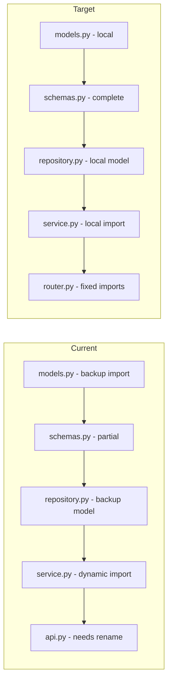

# Plan: Migrate school_authority Module from Backup

## Current State Analysis

### Existing Module (modules/school/school_authority/)
The module exists but has issues:

| File | Current State | Issues |
|------|---------------|--------|
| `models.py` | ⚠️ Imports from backup | Should use modules.shared.base |
| `schemas.py` | ⚠️ Partial | Missing AuthorityUpdate, AuthorityListResponse |
| `repository.py` | ⚠️ Uses backup model | Should use local model |
| `service.py` | ⚠️ Uses dynamic import | Should use local import |
| `api.py` | ⚠️ Uses backup imports | Should use local imports |
| `router.py` | ❌ Missing | Need to create or rename api.py |

### Source from Backup (backup/modules/school/authority/)
| File | Contents |
|------|----------|
| `schemas.py` | AuthorityBase, AuthorityCreate, AuthorityUpdate, AuthorityResponse, AuthorityListResponse |
| `repository.py` | Full CRUD: create, get, get_by_user_id, get_all, update, delete |
| `service.py` | Full business logic: create, get, get_by_user, list, update, delete |
| `api.py` | All endpoints: POST, GET /, GET /{id}, PATCH, DELETE |

---

## Detailed Migration Plan

### Step 1: Update `schemas.py`
**Source:** `backup/modules/school/authority/schemas.py`
**Target:** `modules/school/school_authority/schemas.py`

Add missing schemas:
- `AuthorityUpdate` - update schema with position, department, phone
- `AuthorityListResponse` - list response with authorities and total

### Step 2: Update `repository.py`
**Source:** `backup/modules/school/authority/repository.py`
**Target:** `modules/school/school_authority/repository.py`

Changes needed:
- Import Authority model from local modules instead of backup
- Pass db as parameter to __init__ instead of method parameter

### Step 3: Update `service.py`
**Source:** `backup/modules/school/authority/service.py`
**Target:** `modules/school/school_authority/service.py`

Changes needed:
- Import from local modules
- Pass db to repository in __init__

### Step 4: Rename `api.py` to `router.py`
**Source:** `backup/modules/school/authority/api.py`
**Target:** `modules/school/school_authority/router.py`

Changes needed:
- Rename api.py to router.py
- Fix imports to use local modules
- Change `get_async_db` → `get_db`
- Change `get_current_authority` → `get_current_user` (or create dependency)

---

## Import Fixes Required

| Old (backup) | New (modules) |
|--------------|---------------|
| `from backup.models.school.authority import SchoolAuthority` | `from .models import Authority` |
| `from backup.modules.school.authority.schemas import ...` | `from .schemas import ...` |
| `from modules.shared.database import get_async_db` | `from modules.shared.database import get_db` |
| `from modules.shared.auth import get_current_authority` | `from modules.auth.dependencies import get_current_user` |

---

## Mermaid Diagram

---

## Next Steps

1. Approve this plan → Proceed to implementation in Code mode
2. Request changes → Specify modifications
3. Continue to next module
