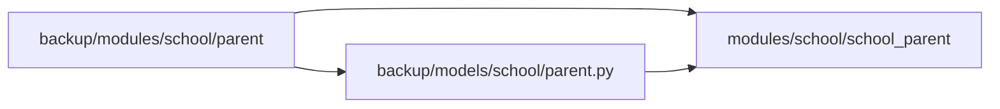

# Plan: Migrate school_parent Module from Backup

## Current State Analysis

### Existing Module (modules/school/school_parent/)
All files are **EMPTY** - needs complete migration from backup.

| File | Current State | Action Required |
|------|---------------|-----------------|
| `models.py` | 🆕 Empty | Create model |
| `schemas.py` | 🆕 Empty | Copy from backup |
| `repository.py` | 🆕 Empty | Copy from backup |
| `service.py` | 🆕 Empty | Copy from backup |
| `router.py` | 🆕 Empty | Copy from backup |

### Source from Backup (backup/modules/school/parent/)
| File | Contents |
|------|----------|
| `backup/models/school/parent.py` | SchoolParent model |
| `schemas.py` | ParentBase, ParentCreate, ParentUpdate, Parent |
| `repository.py` | Full CRUD: create, get, get_by_user_id, get_all, update, delete |
| `service.py` | Full business logic: create, get, get_all, update, delete |
| `api.py` | All endpoints: POST /, GET /{id}, GET /, PUT /{id}, DELETE /{id} |

---

## Migration Steps

### Step 1: Create `models.py`
**Source:** `backup/models/school/parent.py`

Create the Parent model:
```python
from sqlalchemy import Column, Integer, String, ForeignKey, Text
from sqlalchemy.orm import relationship
from modules.shared.base import Base

class Parent(Base):
    __tablename__ = "school_parents"
    __table_args__ = {'extend_existing': True}
    
    id = Column(Integer, primary_key=True, index=True)
    user_id = Column(Integer, ForeignKey("users.id", ondelete="CASCADE"), unique=True, nullable=False)
    full_name = Column(String(255))
    phone = Column(String(20))
    address = Column(Text)
    occupation = Column(String(100))
    
    user = relationship("User", lazy="selectin")
```

### Step 2: Create `schemas.py`
**Source:** `backup/modules/school/parent/schemas.py`

Copy schemas:
- `ParentBase` - base fields
- `ParentCreate` - extends with user_id
- `ParentUpdate` - optional fields for update
- `Parent` - response with id and user_id

### Step 3: Create `repository.py`
**Source:** `backup/modules/school/parent/repository.py`

Copy all methods:
- `create(data)` - create parent
- `get(parent_id)` - get by ID
- `get_by_user_id(user_id)` - get by user ID
- `get_all(skip, limit)` - list all
- `update(parent_id, data)` - update
- `delete(parent_id)` - delete

### Step 4: Create `service.py`
**Source:** `backup/modules/school/parent/service.py`

Copy all methods:
- `create(data)` - create parent
- `get(parent_id)` - get by ID
- `get_all(skip, limit)` - list all
- `update(parent_id, data)` - update
- `delete(parent_id)` - delete

### Step 5: Create `router.py`
**Source:** `backup/modules/school/parent/api.py`

Copy all endpoints:
- `POST /` - Create parent
- `GET /{parent_id}` - Get by ID
- `GET /` - List all
- `PUT /{parent_id}` - Update
- `DELETE /{parent_id}` - Delete

---

## Import Fixes Required

| Old (backup) | New (modules) |
|--------------|---------------|
| `from backup.models.base import Base` | `from modules.shared.base import Base` |
| `from backup.modules.school.parent.schemas import ...` | `from .schemas import ...` |
| `from backup.models.school.parent import SchoolParent` | `from .models import Parent` |
| `from modules.shared.database import get_async_db` | `from modules.shared.database import get_db` |
| `from modules.shared.auth import get_current_user` | `from modules.auth.dependencies import get_current_user` |

---

## Mermaid Diagram



---

## Next Steps

1. Approve this plan → Proceed to implementation in Code mode
2. Request changes → Specify modifications
3. Continue to next module
