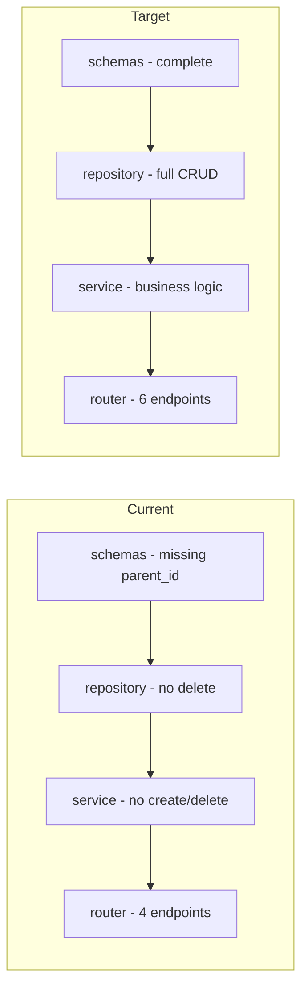

# Plan: Migrate school_student Module from Backup

## Current State Analysis

### Existing Module (modules/school/school_student/)
The module exists but is incomplete:

| File | Current State | Issues |
|------|---------------|--------|
| `models.py` | ✅ Complete | Uses correct table `school_students` |
| `schemas.py` | ⚠️ Partial | Missing `parent_id` field in StudentBase |
| `repository.py` | ⚠️ Basic | Missing `delete`, `get_by_student_id` |
| `service.py` | ⚠️ Basic | Missing `create()` with validation |
| `router.py` | ⚠️ Limited | Missing POST (create), DELETE endpoints |

### Source from Backup (backup/modules/school/student/)
| File | Contents |
|------|----------|
| `schemas.py` | `StudentBase`, `StudentCreate`, `StudentUpdate`, `Student` (includes parent_id) |
| `repository.py` | Full CRUD: create, get, get_by_user_id, get_all with filtering, update, delete |
| `service.py` | Full business logic: create, get, get_by_user_id, get_all, update, delete |
| `api.py` | All endpoints: POST /, GET /{id}, GET /, PUT /{id}, DELETE /{id} |

---

## Detailed Migration Plan

### Step 1: Update `schemas.py`
**Source:** `backup/modules/school/student/schemas.py`
**Target:** `modules/school/school_student/schemas.py`

Changes needed:
- Add `parent_id: Optional[int] = None` to `StudentBase`
- Add `parent_id` to `StudentUpdate`
- Rename `StudentResponse` → `Student` for consistency

### Step 2: Update `repository.py`
**Source:** `backup/modules/school/student/repository.py`
**Target:** `modules/school/school_student/repository.py`

Add missing methods:
- `get_by_student_id()` - lookup by student_id string
- `delete(student_id)` - delete by ID

### Step 3: Update `service.py`
**Source:** `backup/modules/school/student/service.py`
**Target:** `modules/school/school_student/service.py`

Add business logic:
- `create(data)` - create new student
- `delete(student_id)` - delete student

### Step 4: Update `router.py`
**Source:** `backup/modules/school/student/api.py`
**Target:** `modules/school/school_student/router.py`

Add endpoints:
- `POST /` - Create student
- `DELETE /{student_id}` - Delete student

---

## Mermaid Diagram

---

## File-by-File Changes Summary

### 1. schemas.py
| Field | Current | Target |
|-------|---------|--------|
| StudentBase.parent_id | ❌ Missing | ✅ Add |

### 2. repository.py
| Method | Current | Target |
|--------|---------|--------|
| get_by_student_id | ❌ Missing | ✅ Add |
| delete | ❌ Missing | ✅ Add |

### 3. service.py
| Method | Current | Target |
|--------|---------|--------|
| create | ❌ Missing | ✅ Add |
| delete | ❌ Missing | ✅ Add |

### 4. router.py
| Endpoint | Current | Target |
|----------|---------|--------|
| POST / | ❌ Missing | ✅ Add |
| DELETE /{id} | ❌ Missing | ✅ Add |

---

## Import Fixes Required

| Old (backup) | New (modules) |
|--------------|---------------|
| `from backup.modules.school.student.schemas import ...` | `from .schemas import ...` |
| `from backup.models.school.student import SchoolStudent` | `from .models import Student` |
| `from modules.shared.database import get_async_db` | `from modules.shared.database import get_db` |
| `from modules.shared.auth import get_current_user` | `from modules.auth.dependencies import get_current_user` |

---

## Execution Order

1. **schemas.py** - Add missing parent_id field
2. **repository.py** - Add missing methods
3. **service.py** - Add create/delete methods
4. **router.py** - Add POST/DELETE endpoints

---

## Next Steps

1. Approve this plan → Proceed to implementation in Code mode
2. Request changes → Specify modifications
3. Expand scope → Include other modules
