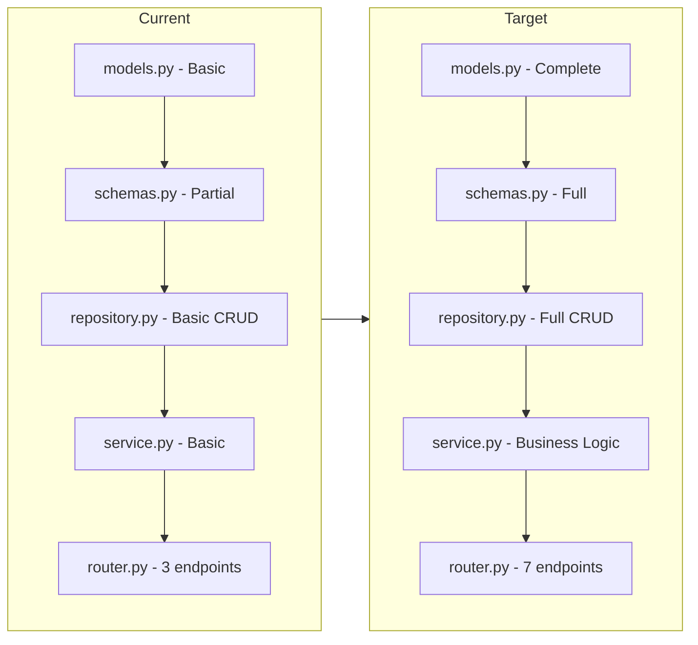

# Plan: Enhance school_teacher Module from Backup

## Current State Analysis

### Existing Module (modules/school/school_teacher/)
The module exists but is incomplete:

| File | Current State | Issues |
|------|---------------|--------|
| `models.py` | ✅ Exists | Uses `Teacher` class with correct base |
| `schemas.py` | ⚠️ Partial | Missing `TeacherUpdate`, `TeacherWithUser` |
| `repository.py` | ⚠️ Basic | Missing `update`, `delete`, `get_by_employee_id`, filtering |
| `service.py` | ⚠️ Basic | Missing create validation, deactivate, update logic |
| `router.py` | ⚠️ Limited | Missing POST (create), PUT (update), DELETE, deactivate endpoints |

### Source from Backup (backup/modules/school/teacher/)
| File | Contents |
|------|----------|
| `schemas.py` | `TeacherBase`, `TeacherCreate`, `TeacherUpdate`, `Teacher`, `TeacherWithUser` |
| `repository.py` | Full CRUD: create, get, get_by_user_id, get_by_employee_id, get_all, update, delete |
| `service.py` | Full business logic: create with validation, get, get_all, get_active_teachers, update, delete, deactivate |
| `api.py` | All endpoints: POST /, GET /{id}, GET /by-user/{user_id}, GET /, PUT /{id}, DELETE /{id}, POST /{id}/deactivate |

---

## Detailed Migration Plan

### Step 1: Update `models.py`
**Source:** `backup/models/school/teacher.py` (SchoolTeacher class)
**Target:** `modules/school/school_teacher/models.py`

Changes needed:
- Keep the existing `Teacher` class (it's already correct)
- Add relationship to `SchoolCourse` if it exists in modules/school
- Keep existing table name `teachers` or change to `school_teachers` to match backup

```python
# Current (keep this):
class Teacher(Base):
    __tablename__ = "teachers"
    # ... existing fields
```

### Step 2: Update `schemas.py`
**Source:** `backup/modules/school/teacher/schemas.py`
**Target:** `modules/school/school_teacher/schemas.py`

Add missing schemas:
```python
class TeacherUpdate(BaseModel):
    employee_id: Optional[str] = Field(None, min_length=1, max_length=50)
    full_name: Optional[str] = None
    phone: Optional[str] = None
    department: Optional[str] = None
    qualification: Optional[str] = None
    specialization: Optional[str] = None
    status: Optional[str] = None

class TeacherWithUser(Teacher):
    email: Optional[str] = None
    username: Optional[str] = None
```

### Step 3: Update `repository.py`
**Source:** `backup/modules/school/teacher/repository.py`
**Target:** `modules/school/school_teacher/repository.py`

Add missing methods:
- `get_by_employee_id()`
- `get_all()` with department/status filtering
- `update()` with TeacherUpdate data
- `delete()`

### Step 4: Update `service.py`
**Source:** `backup/modules/school/teacher/service.py`
**Target:** `modules/school/school_teacher/service.py`

Add business logic:
- `create()` with validation (check duplicate employee_id and user_id)
- `get_all()` with filtering
- `get_active_teachers()`
- `update()`
- `delete()`
- `deactivate()`

### Step 5: Update `router.py`
**Source:** `backup/modules/school/teacher/api.py`
**Target:** `modules/school/school_teacher/router.py`

Add endpoints:
- `POST /` - Create teacher
- `GET /by-user/{user_id}` - Get by user ID
- `PUT /{teacher_id}` - Update teacher
- `DELETE /{teacher_id}` - Delete teacher
- `POST /{teacher_id}/deactivate` - Deactivate teacher

---

## Mermaid Diagram: Current vs Target State



---

## File-by-File Changes Summary

### 1. models.py (modules/school/school_teacher/models.py)
- **Status:** OK - Keep as-is or add course relationship
- **Action:** Verify table name matches database

### 2. schemas.py (modules/school/school_teacher/schemas.py)
- **Missing:** `TeacherUpdate`, `TeacherWithUser`
- **Action:** Add these from backup

### 3. repository.py (modules/school/school_teacher/repository.py)
- **Missing methods:** 
  - `get_by_employee_id()`
  - `get_all(department, status, skip, limit)`
  - `update(teacher_id, data)`
  - `delete(teacher_id)`
- **Action:** Add from backup

### 4. service.py (modules/school/school_teacher/service.py)
- **Missing methods:**
  - `create(data)` - with validation
  - `get_all()` - with filtering
  - `get_active_teachers()`
  - `update(teacher_id, data)`
  - `delete(teacher_id)`
  - `deactivate(teacher_id)`
- **Action:** Add from backup

### 5. router.py (modules/school/school_teacher/router.py)
- **Missing endpoints:**
  - `POST /` - Create teacher
  - `GET /by-user/{user_id}` - Get by user
  - `PUT /{teacher_id}` - Update
  - `DELETE /{teacher_id}` - Delete
  - `POST /{teacher_id}/deactivate` - Deactivate
- **Action:** Add from backup (map api.py → router.py)

---

## Import Fixes Required

When migrating from backup, fix these imports:

| Old (backup) | New (modules) |
|--------------|----------------|
| `from backup.models.base import Base` | `from modules.shared.base import Base` |
| `from backup.modules.school.teacher.schemas import ...` | `from .schemas import ...` |
| `from modules.shared.database import get_async_db` | `from modules.shared.database import get_db` |
| `from modules.shared.auth import get_current_user` | `from modules.auth.dependencies import get_current_user` |

---

## Next Steps

1. **Approve this plan** → Proceed to code implementation
2. **Request changes** → Specify which parts to skip/modify
3. **Expand scope** → Include other modules (student, parent, etc.)

---

## Estimated Effort

- **Files to modify:** 4 (schemas, repository, service, router)
- **New endpoints:** 4 (POST, PUT, DELETE, deactivate)
- **New methods:** 10+ (CRUD operations)
- **Complexity:** Low-Medium (mostly copy-paste with import fixes)
