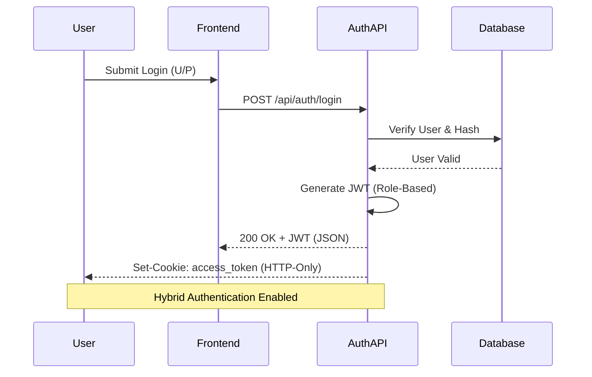

# System Security Overview

This document outlines the multi-layered security architecture and protocols implemented in the School Management System.

## 1. Authentication Architecture

The system employs a hybrid authentication strategy designed for both security and flexibility, supporting API-first clients and browser-based users.

### Core Technologies
- **JWT (JSON Web Tokens):** Standard for stateless authentication. Tokens contain encrypted user IDs and role claims.
- **OAuth2 Bearer Flow:** Implemented for secure API communication.
- **HTTP-Only Cookies:** Prevents Cross-Site Scripting (XSS) by ensuring tokens cannot be accessed via Client-Side JavaScript.

---

## 2. Data Protection & Hashing

We prioritize the integrity and confidentiality of user sensitive data through modern cryptographic standards.

### Password Security
- **Algorithm:** Passwords are never stored in plain text. We use `bcrypt` with a salt cost of `12`.
- **Constraint Handling:** The system automatically manages the 72-byte limit of the `bcrypt` algorithm by truncating input to ensure consistent verification.
- **Repository Implementation:** Managed centrally in `UserRepository.get_password_hash()`.

> [!IMPORTANT]
> The `SECRET_KEY` and `ALGORITHM` are managed via environment variables to ensure zero-leakage into the source code.

---

## 3. Role-Based Access Control (RBAC)

Access is strictly enforced at the dependency layer using FastAPI's dependency injection system.

| Role | Access Level | Primary Dependencies |
| :--- | :--- | :--- |
| **Authority** | Administrative / Global Management | `get_current_authority` |
| **Teacher** | Class Management / Grading / Chat | `get_current_teacher` |
| **Student** | Resource Consumption / Assignments | `get_current_student` |
| **Parent** | Linked Student View / Fee Payment | `get_current_parent` |

> [!TIP]
> Higher-level routes often use `get_current_teacher_or_authority` to streamline management access without compromising security granularity.

---

## 4. File & Upload Security

Handling user-generated content requires rigorous validation to prevent remote code execution or server exhaustion.

- **UUID Renaming:** All uploaded files are renamed using `uuid.uuid4()` to prevent directory traversal and filename conflicts.
- **Size Enforcement:** Maximum file size is limited to **10MB** as defined in `config.py`.
- **Extension Whitelisting:** Only safe extensions are permitted (`pdf, doc, docx, jpg, jpeg, png, mp4, avi, mov`).
- **Storage Strategy:** Files are organized into role-specific subdirectories (e.g., `/uploads/assignments`, `/uploads/avatars`).

---

## 5. Network & Infrastructure

- **CORS Management:** Strict Cross-Origin Resource Sharing (CORS) policies are enforced to only allow trusted origins (`http://localhost:8000`, etc.).
- **Environment Isolation:** Separate configurations for `DEBUG` and Production modes ensure that detailed error stack traces are not leaked to end-users in production.
- **Background Cleanup:** Automated services run daily at 02:00 AM to purge expired messages and temporary session data.
